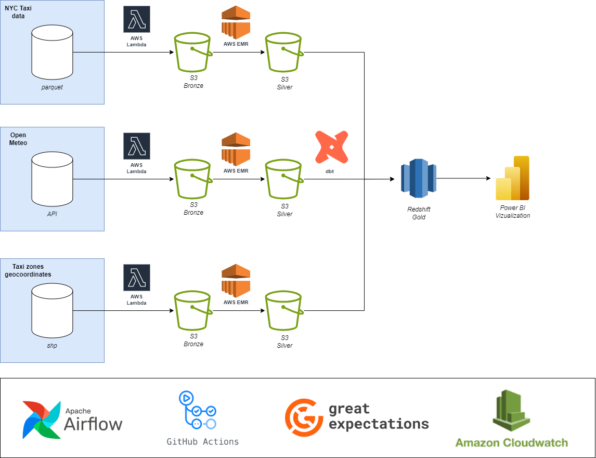

# OVERVIEW
This project builds a complete data architecture using open data from the New York City Trip Record Data. The data consists of Yellow and Green Taxis, FHV (For-Hire Vehicles), and HVFHV (High Volume For-Hire Vehicles, such as Uber, Lyft, etc.). The data can be found at https://www.nyc.gov/site/tlc/about/tlc-trip-record-data.page#
Additionally, weather data is integrated from the OpenMeteo API.

The goal of this project is to provide users with curated data and metrics related to Ride services in New York. The data can be used for dashboards, analytics, and data science applications.
Plus, the project serves as a guide on how to structure an end-to-end solution leveraging open-source tools and cloud services.

# DATA ARCHITECTURE

The bellow diagram ilustrates the Data Architecture.



Following the Medallion Architecture, the project is organized into these layers:

## From files and api to Raw (bronze)
**AWS Lambda**
Data will be loaded into S3 in its as-is format (parquet and JSON*).
_*Data may be converted to Parquet to reduce storage costs — TBD._

## From Raw to Curated (silver)
**Pyspark in AWS EMR**
Data will be cleaned, deduplicated and filtered. It will be stored in apache iceberg.

## From Curated to Analytics (gold): 
**dbt (Data Build Tool)**
From iceberg, create business logic and metrics, and store the data in redshift for querying and dashboards

## Orchestration
Apache Airflow - MWAA (Managed Workflows for Apache Airflow)

## Monitoring and Logging
AWS CloudWatch and Great expectations (TBC)

# PROJECT STRUCTURE

```
src/
 └── curated/
     ├── jobs/        # Spark jobs
     ├── utils/       # Utility functions (e.g., create Spark session)
     └── tests/       # Test scripts for validating transformations
sample_data/
 └── raw/             # Raw input data
 └── curated/         # Output of curated (cleaned) jobs
 └── analytics/       # Output of analytics jobs in dbt
lockup_tables/        # Reference tables (e.g., payment types, rate codes)
notebooks/            # Jupyter Notebooks used for data exploration
orchestration/        # WIP
infrastructure/       # WIP
```
