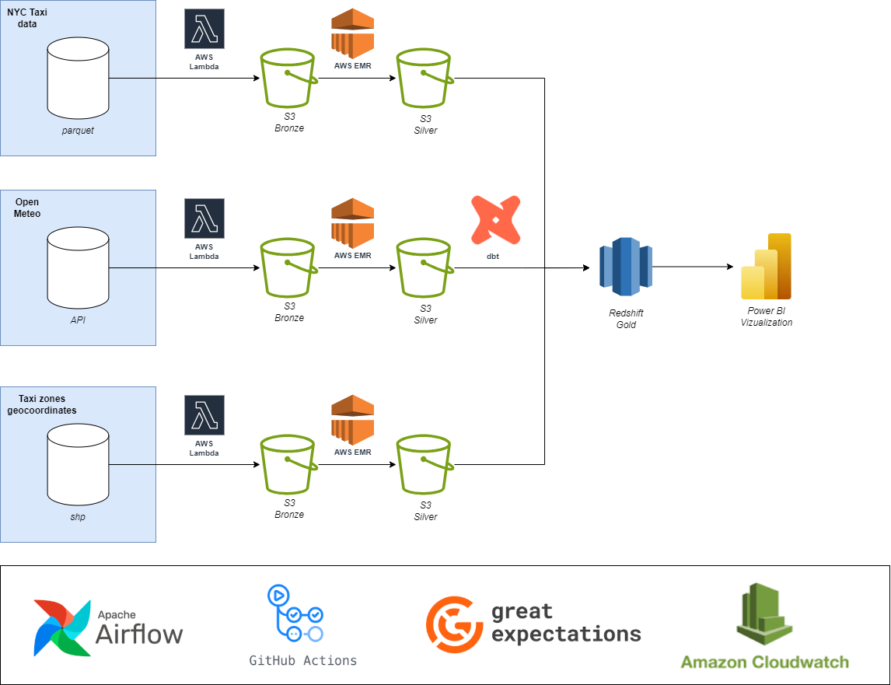

# OVERVIEW
This project is a complete data architecture using the open data from New York City Trip Record Data. The data is compossed of Yellow and Green Taxi, FHV (For-Hire Vehicle) and HVFHV (High Volume For-Hire Vehicle - which would be Uber, Lyft, etc.). The data can be found at https://www.nyc.gov/site/tlc/about/tlc-trip-record-data.page#
The data is also combined with weather data from OpenMeteo API.

The goal of this project is to provide users with curated data and metrics related to Ride services in New York. The data can be used for dashboards and data science. 
Plus, the project aims to provide guidance on how to structure an end-to-end project leveraging open-source tools and the cloud.

# DATA ARCHITECTURE

The bellow diagram ilustrates the Data Architecture.

Using the Medalling Architecture, the product is organized in these steps:

## From files and api to Raw (bronze)
**AWS Lambda**
Data will be loaded into s3 in the as-is format (parquet and json*)
*or convert into parquet to reduce storage cost - TBD

## From Raw to Curated (silver)
**Pyspark in AWS EMR**
Data will be cleaned, deduplicated and filtered. It will be stored in apache iceberg.

## From Curated to Analytics (gold): 
**dbt**
From iceberg, create business logic and metrics, and store the data in redshift for querying and dashboards

## Orchestration
Apache Airflow - MWAA (Managed Workflows for Apache Airflow)

## Monitoring and Logging
AWS CloudWatch and Great expectations (TBC)

# PROJECT STRUCTURE

src/
 └── curated/
     ├── jobs/        # Spark jobs
     ├── utils/       # Utility functions (e.g., create Spark session)
     └── tests/       # Test scripts for validating transformations
sample_data/
 └── raw/             # Raw input data
 └── curated/         # Output of curated (cleaned) jobs
 └── analytics/       # Output of analytics jobs in dbt
lockup_tables/        # Reference tables (e.g., payment types, rate codes)
notebooks/            # Jupyter Notebooks used for data exploration
orchestration/        # WIP
infrastructure/       # WIP